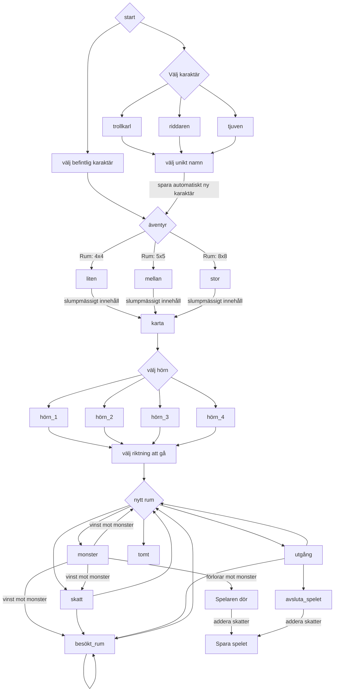

```mermaid
graph TD
    start{start} --> välj_karta{Välj karaktär}
    start --> välj_befintlig_karaktär[välj befintlig karaktär]
    välj_befintlig_karaktär --> äventyr
    välj_karta --> trollkarl
    välj_karta --> riddaren
    välj_karta --> tjuven
    trollkarl --> välj_namn[välj unikt namn]
    riddaren --> välj_namn
    tjuven --> välj_namn
    välj_namn --> |spara automatiskt ny karaktär|äventyr{äventyr}
    äventyr --> |Rum: 4x4|liten
    äventyr --> |Rum: 5x5|mellan
    äventyr --> |Rum: 8x8|stor
    liten --> |slumpmässigt innehåll|karta
    mellan --> |slumpmässigt innehåll|karta
    stor --> |slumpmässigt innehåll|karta
    karta --> välj_hörn{välj hörn}
    välj_hörn --> hörn_1
    välj_hörn --> hörn_2
    välj_hörn --> hörn_3
    välj_hörn --> hörn_4
    hörn_1 --> riktning[välj riktning att gå]
    hörn_2 --> riktning
    hörn_3 --> riktning
    hörn_4 --> riktning
    riktning --> nytt_rum{nytt rum}
    nytt_rum --> skatt
    nytt_rum --> monster
    nytt_rum --> utgång
    nytt_rum --> tomt
    monster --> |vinst mot monster|skatt 
    monster --> |vinst mot monster|besökt_rum
    monster --> |vinst mot monster|nytt_rum
    monster --> |förlorar mot monster|game_over[Spelaren dör]
    skatt --> nytt_rum
    skatt --> besökt_rum
    game_over --> |addera skatter|spara_spelet
    utgång --> besökt_rum
    utgång --> nytt_rum
    utgång --> avsluta_spelet
    avsluta_spelet --> |addera skatter|spara_spelet[Spara spelet]
    besökt_rum --> besökt_rum
    besökt_rum --> nytt_rum

```
