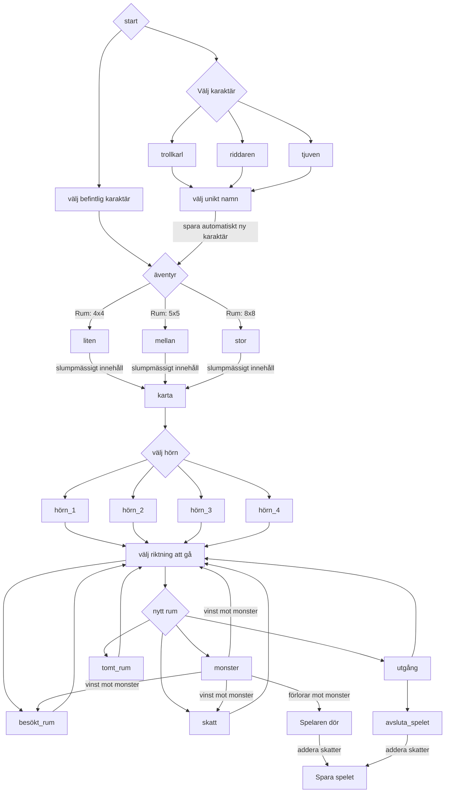
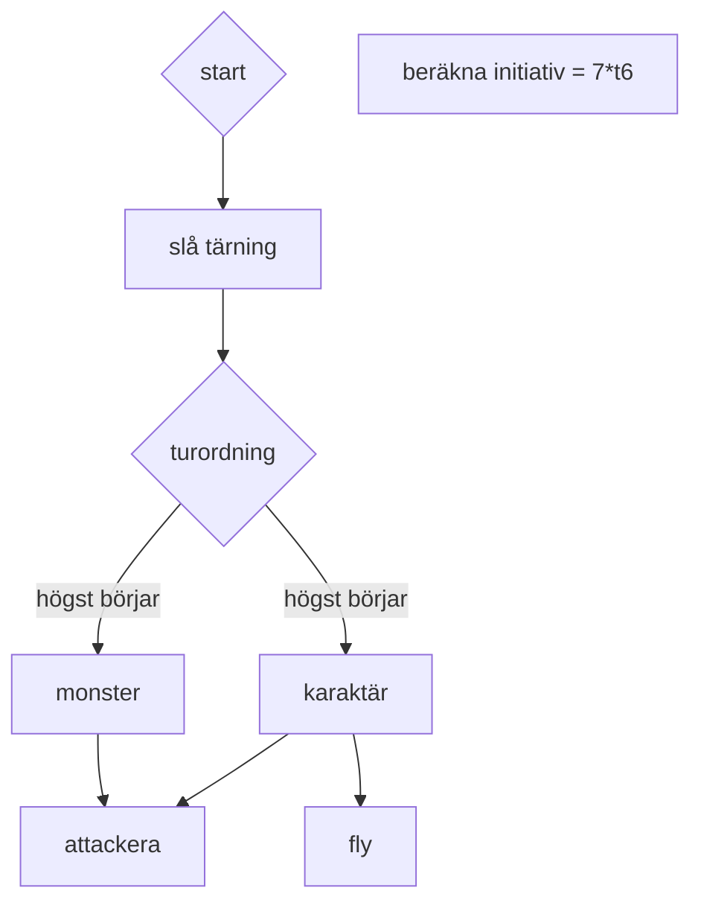

# Spelrunda

## Graf

Graf över en spelrunda.

Beskrivning.

1. På startskärmen kan spelaren välja att skapa en ny karaktär eller ladda en befintlig
a. Spelaren väljer en typ av hjälte
b. Spelaren får skriva in ett namn till sin karaktär (namnet får inte redan finnas sparat)
c. Varje skapad karaktär ska automatiskt sparas för att kunna laddas in en annan gång
2. Nästa steg är att starta ett äventyr. Spelaren väljer storlek på äventyret; litet, lagom eller
stort
3. En karta med slumpmässigt innehåll skapas i vald storlek och spelaren får välja i vilket hörn
av kartan som hen vill börja
4. Spelaren väljer åt vilket håll hen vill gå för att komma till ett nytt rum
5. När spelaren går in i ett nytt rum (ej redan besökt rum) sker:
a. Strid med monster (om det finns några i rummet)
b. Plocka upp skatter (om det finns några, och om spelaren fortfarande lever)
c. Välja åt vilket håll spelaren ska fortsätta gå
d. Om rummet innehåller en utgång sker varken a. eller b. Istället får spelaren ett
alternativ om hen vill lämna kartan, eller stanna kvar.
6. Om spelaren går in i ett redan besökt rum kan hen endast välja att gå vidare
7. Äventyret tar slut när spelaren lämnar kartan eller blir besegrad
8. När ett äventyr tar slut adderas de ihopsamlade skatterna till den sparade spelkaraktären.
Man kan alltså spela flera äventyr med samma sparade karaktär för att samla på sig skatter.

## Sequence diagram

Graf för en strid.

Beskrivning

Strider inträffar när spelaren gå in i ett rum som innehåller ett eller flera monster. De avgörs genom att slå sex-sidiga tärningar. T.ex. om ett monster har Attack-värde 2, så ska 2 stycken sex-sidiga tärningar slås och summeras. Striderna sker i tur och ordning och inte i realtid. En strid följer denna process:

1. Turordningen avgörs genom att alla stridsdeltagare slår lika antal tärningar som sitt Initiativ.Högst börjar och resten ordnas i fallande skala. Denna turordning gäller tills striden är slut.
2. Vi antar att spelaren börjar, som då får alternativen Attackera och Försök fly
a. Attackera: Slår lika antal tärningar som sitt Attack-värde. Motståndaren slår motsvarande sitt Smidighets-värde.
i. Om Attack-resultatet är större än Smidighets-resultatet får monstret 1 i skada, vilket dras från Tålighet. Om Tålighet når noll blir monstret besegrat.
ii. Om Smidighets-resultatet är större än Attack-resultatet så missar attacken.
b. Försök fly: Smidighet * 10 = X% chans att fly.
i. Om spelaren lyckas så blir hen förflyttad tillbaka till föregående rum och striden avbryts. Inga skatter kan plockas upp eftersom monstren inte blev besegrade. Spelet ska komma ihåg vilka monster som finns kvar i rummet,dock så ska Tålighet återställas på monster när ett rum lämnas.
ii. Om spelaren misslyckas fly så förblir hen kvar i rummet och det blir monstrets tur att attackera.
3. När det är ett monsters tur så attackerar denne alltid. Samma beräkning som ovan genomförs (se 2.a.), fast då jämförs monstrets Attack-resultat mot spelarens Smidighets-resultat.
4. Striden fortsätter tills antingen spelaren är besegrad, har flytt eller alla monster är besegrade.
a. Om spelaren är besegrad så är äventyret slut
b. Om alla monster är besegrade så plockar spelaren upp eventuella skatter och fårsedan välja åt vilket håll hen ska fortsätta gå
