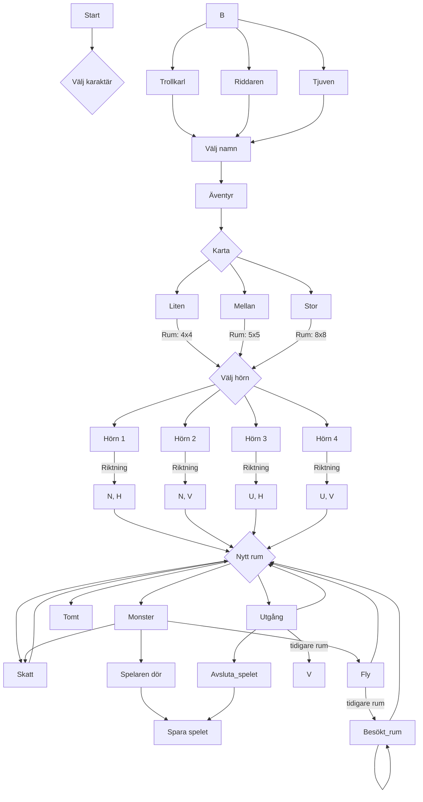

```mermaid
graph TD
    Start --> välj_karta{Välj karaktär}
    B --> D[Trollkarl]
    B --> E[Riddaren]
    B --> F[Tjuven]
    D --> G[Välj namn]
    E --> G[Välj namn]
    F --> G[Välj namn]
    G --> H[Äventyr]
    H --> I{Karta}
    I --> J[Liten]
    I --> K[Mellan]
    I --> L[Stor]
    J --> |Rum: 4x4|M{Välj hörn}
    K --> |Rum: 5x5|M{Välj hörn}
    L --> |Rum: 8x8|M{Välj hörn}
    M --> N[Hörn 1]
    M --> O[Hörn 2]
    M --> P[Hörn 3]
    M --> Q[Hörn 4]
    N --> |Riktning| R[N, H]
    O --> |Riktning| S[N, V]
    P --> |Riktning| T[U, H]
    Q --> |Riktning| U[U, V]
    R --> Nytt_rum{Nytt rum}
    S --> Nytt_rum
    T --> Nytt_rum
    U --> Nytt_rum
    Nytt_rum --> Skatt
    Nytt_rum --> Monster
    Nytt_rum --> Utgång
    Nytt_rum --> Tomt
    Monster --> Skatt 
    Skatt --> Nytt_rum
    Monster --> Game_over[Spelaren dör]
    Game_over --> Spara_spelet
    Monster --> Fly
    Fly --> |tidigare rum|Besökt_rum
    Fly --> Nytt_rum
    Utgång --> |tidigare rum|V
    Utgång --> Nytt_rum
    Utgång --> Avsluta_spelet
    Avsluta_spelet --> Spara_spelet[Spara spelet]
    Besökt_rum --> Besökt_rum
    Besökt_rum --> Nytt_rum

```
