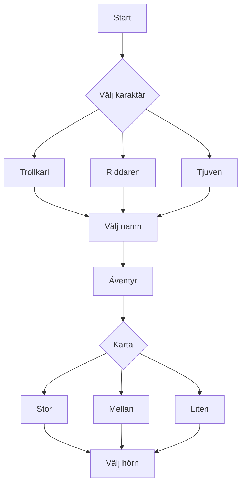

```mermaid
graph TD
    A[Start] -->B{Välj karaktär}
    B --> D[Trollkarl]
    B --> E[Riddaren]
    B --> F[Tjuven]
    D --> G[Välj namn]
    E --> G[Välj namn]
    F --> G[Välj namn]
    G --> H[Äventyr]
    H --> I{Karta}
    I --> J[Stor]
    I --> K[Mellan]
    I --> L[Liten]
    J --> M[Välj hörn]
    K --> M[Välj hörn]
    L --> M[Välj hörn]
    
```
